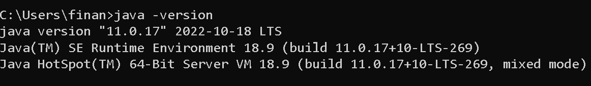
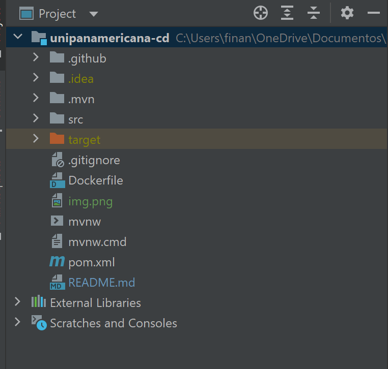
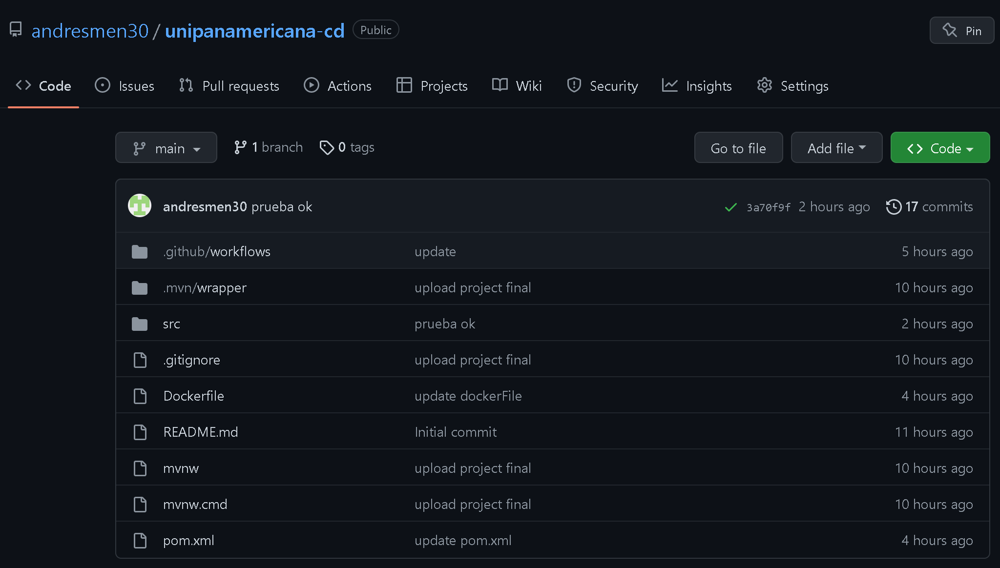
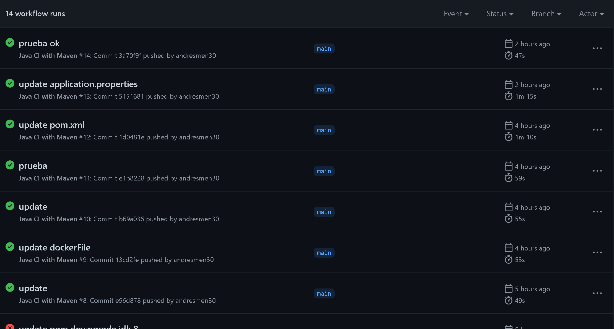
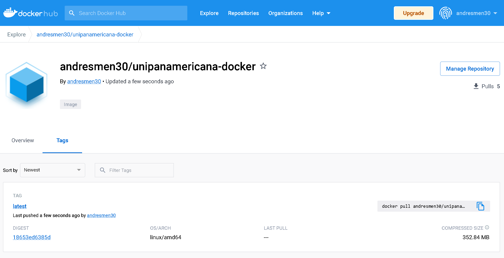

# Unipanamericana CD

_Proyecto de registro de estudiantes, usando GitHub Action y Docker_

## Integrantes

* _Andrés Felipe Mendez_
* _Sebastian Correa_
* _Juan Sebastian Cruz_
* _Cristian Alberto Loza_
* _Oscar Eduardo Varon_

## Comenzando  🚀

_Estas instrucciones te permitirán obtener una copia del proyecto en funcionamiento en tu máquina local para propósitos de desarrollo y pruebas._

### Prerrequisitos 📋

* _Crear una cuenta de GitHub -> [Registrar cuenta](https://github.com/join)_
* _Crear cuenta en Docker Hub -> [Registrar cuenta](https://www.docker.com/products/docker-hub/)_
* _Docker -> [Descargar Docker](https://www.docker.com/products/docker-desktop/)_
* _JDK 11 -> [Descargar JDK 11](https://www.oracle.com/java/technologies/javase/jdk11-archive-downloads.html)_
* _Proyecto Spring boot de prueba -> [Iniciar un proyecto Spring Boot](https://start.spring.io/)_


## Instalación y configuración 🔧

### Java

_**1**. Para la primera instancia necesitaremos confirmar que la versión de JDK este correctamente instalada._

```
java -version
```

_Nos mostrara algo como esto_




_**2**. Ahora iniciaremos nuestro proyecto de Spring Boot ya creado en nuestro IDE de preferencia, para este ejemplo usaremos Intellij IDEA._



_**3**. Subir proyecto a GitHub_

```
git init -b main
```
```
git add .
```
```
git commit -m "First commit"
```
```
git remote add origin <REMOTE_URL>
```
```
git remote -v
```
```
git push origin main
```


**_Si todo salio bien veremos algo como esto_**


_**3**. Creación de Pipeline GitHub Actions_

**_Para esto debemos crear el archivo maven.yml en workflows. Estos son steps que va a ejecutar el pipeline al momento de subir algún cambio_**

```
name: Java CI with Maven

on:
  push:
    branches: [ "main" ]
  pull_request:
    branches: [ "main" ]

jobs:
  build:

    runs-on: ubuntu-latest

    steps:
    - uses: actions/checkout@v3
    - name: Set up JDK 11
      uses: actions/setup-java@v3
      with:
        java-version: '11'
        distribution: 'temurin'
        cache: maven
    - name: Build with Maven
      run: mvn clean install

    - name: Build & push Docker image
      uses: mr-smithers-excellent/docker-build-push@v5
      with:
        image: andresmen30/unipanamericana-docker
        tags: latest
        registry: docker.io
        dockerfile: Dockerfile
        username: ${{secrets.DOCKER_USERNAME}}
        password: ${{secrets.DOCKER_PASSWORD}}

```
**_Ejecución del pipeline_**



_**3**. Creación de archivo Dockerfile_
```
FROM openjdk:11
EXPOSE 8080
ADD target/unipanamericana-docker.jar unipanamericana-docker.jar
ENTRYPOINT ["java","-jar","/unipanamericana-docker.jar"]
```

_**4**. Generación de imagen de Docker_



_**5**. Compilación y despliegue de Docker_

```
cd unipanamericana/
```
```
docker-compose stop unipanamericana-app
```
```
docker stop unipanamericana-spring
```
```
docker rm unipanamericana-spring
```
```
docker pull andresmen30/unipanamericana-docker:latest
```
```
docker-compose up -d unipanamericana-app
```
```
docker ps -a
```

## Consumo Servicio /unipanamericana

### url: http://206.189.15.94/unipanamericana/

## Endpoints

### POST /user

Este método crear un registro de estudiante


#### Request exitoso creación de usuario
```
{
    "name" : "Sebastian",
    "lastName" : "Correa",
    "age" : 40,
    "cellPhone" : "3108841601",
    "dni" : "3123123123"
}
```

#### Response exitoso creación de estudiante
```
Se ha creado correctamente
```


#### Request validación mandatoriedad de campos
```
{
    "name" : "",
    "lastName" : "",
    "age" : 40,
    "cellPhone" : "3108841601",
    "dni" : "3123123123"
}
```

#### Response exitoso creación de estudiante
```
{
    "code": 400,
    "message": "No puede ser nulo",
    "details": [
        "lastName : must not be blank",
        "name : must not be blank"
    ]
}
```

### PUT /student/{id}

Este método actualiza un registro de estudiante


#### Request exitoso actualización de estudiante
```
{
    "name" : "Sebastian",
    "lastName" : "Juanito",
    "age" : 13,
    "cellPhone" : "3108841601",
    "dni" : "10191273621"
}
```

#### Response exitoso creación de estudiante
```
Se ha actualizado correctamente
```

### DELETE /student/{id}

Este método elimina un registro de estudiante


#### Request exitoso actualización de estudiante
```
/student/{id}
```

#### Response exitoso creación de estudiante
```
Se ha eliminado correctamente
```

### GET /student

Este método crear un registro de estudiante


#### Request exitoso actualización de estudiante
```
/student
```

#### Response exitoso creación de estudiante
```
[
    {
        "name": "Sebastian",
        "lastName": "Mendez",
        "age": 40,
        "cellPhone": "3108841601",
        "dni": "3123123123"
    },
    {
        "name": "Jose",
        "lastName": "Manuel",
        "age": 40,
        "cellPhone": "3108841601",
        "dni": "3123123123"
    }
]
```


###### Documentación Postman [https://documenter.getpostman.com/view/18030682/2s8YmUKyqz](https://documenter.getpostman.com/view/8454301/UVkmRHEc).


## Construido con 🛠️

_**1**. [Spring boot](https://spring.io/projects/spring-boot)_ - Framework de Java

_**2**. [Java](https://www.java.com/es/)_ - Lenguaje de programación orientado a objetos

_**3**. [Docker y Docker Hub](https://www.docker.com/)_ - Contenedor de paquetes de despliegue

_**4**. [GitHub Actions](https://github.com/features/actions)_ - Automatización de flujos para CI/CD

_**5**. [Base de datos H2](https://www.mysql.com/)_ - Base de datos relacional

_**7**. [Maven](https://maven.apache.org/)_ - Administrar de dependencias


###### Documentación Postman [https://documenter.getpostman.com/view/18030682/2s8YmUKyqz](https://documenter.getpostman.com/view/8454301/UVkmRHEc).
